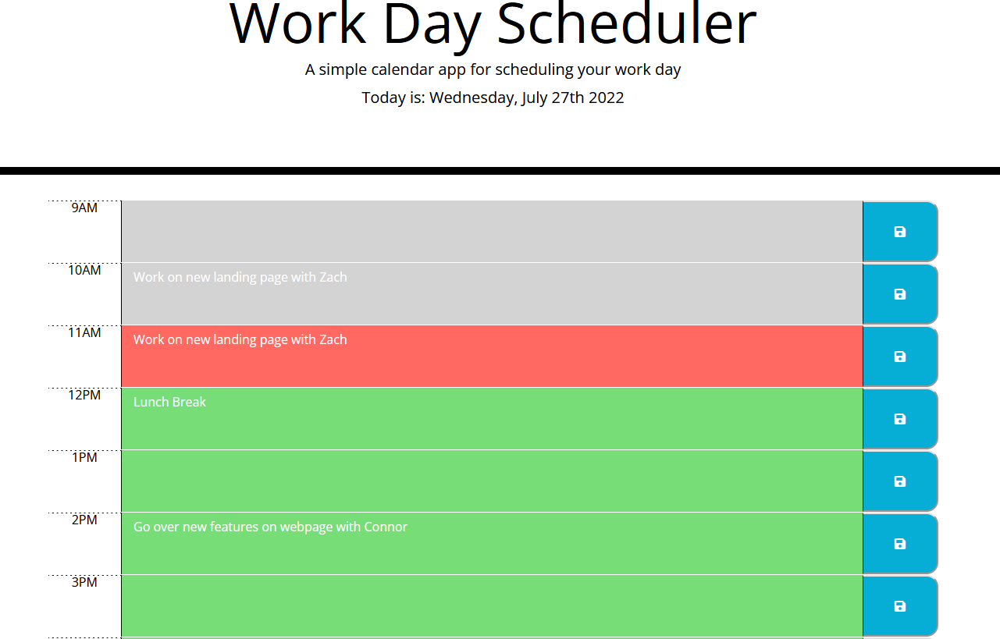

# Work-Day-Scheduler

## Description

This project was developed to work on JavaScript and Third Party APIs.  It is a simple work day scheduler that accurately tracks the day and time.  Currently there is no functionality for going back to previous days, but a simple scheduler for singular days.  This project was mainly a documentation reading project to checkout how well I can incorparate APIs.

## Table of Contents

  - [Description](#description)
  - [Usage](#usage)
  - [Credits](#credits)
  - [License](#license)

## Usage

Here is what the website looks like.  If you want to preview it click [HERE!](https://parksfg.github.io/Work-Day-Scheduler/)

## Credits

I worked on the JS file, and slight modifications to an already provided html and css file

## License

MIT License

Copyright (c) 2022 Parker Gay

Permission is hereby granted, free of charge, to any person obtaining a copy of this software and associated documentation files (the "Software"), to deal in the Software without restriction, including without limitation the rights to use, copy, modify, merge, publish, distribute, sublicense, and/or sell copies of the Software, and to permit persons to whom the Software is furnished to do so, subject to the following conditions:

The above copyright notice and this permission notice shall be included in all copies or substantial portions of the Software.

THE SOFTWARE IS PROVIDED "AS IS", WITHOUT WARRANTY OF ANY KIND, EXPRESS OR IMPLIED, INCLUDING BUT NOT LIMITED TO THE WARRANTIES OF MERCHANTABILITY, FITNESS FOR A PARTICULAR PURPOSE AND NONINFRINGEMENT. IN NO EVENT SHALL THE AUTHORS OR COPYRIGHT HOLDERS BE LIABLE FOR ANY CLAIM, DAMAGES OR OTHER LIABILITY, WHETHER IN AN ACTION OF CONTRACT, TORT OR OTHERWISE, ARISING FROM, OUT OF OR IN CONNECTION WITH THE SOFTWARE OR THE USE OR OTHER DEALINGS IN THE SOFTWARE.
